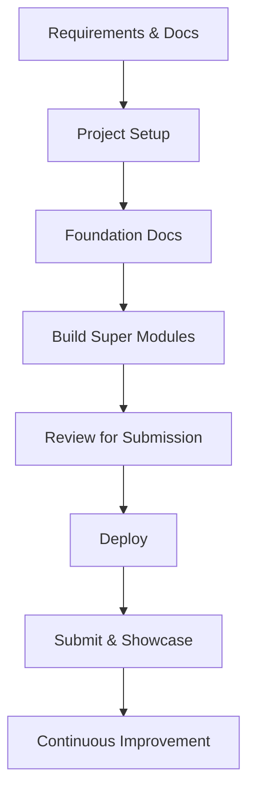

# Gauntlet Project Order of Operations

**Purpose:**  
Provide a concise, outcome-driven roadmap for executing any Foundry Core project from requirements through submission.

---

## 0️⃣ Requirements & Documentation
- Add project assignment and requirements files to `/docs/requirements/`.
- Identify success criteria, rubric expectations, and initial deliverables.
- Store any official PDFs, notes, or project docs.

---

## 1️⃣ Project Setup
- Goal: Create the repo, link it locally, and confirm a working baseline.
- Steps:
  1. Create repository
  2. Create local folder
  3. Connect local folder to repository
  4. Install dependencies and run `pnpm dev`
  5. Verify localhost builds successfully
  6. Copy `.env.example` → `.env.local` and add all keys (Firebase, Supabase, OpenAI)

---

## 2️⃣ Foundation Documents
- Goal: Establish architecture, PRD, and development strategy.
- Steps:
  1. Generate PRD in Ask Mode
  2. Create architecture document
  3. Build dev checklists
  4. Build rest of foundation docs
  5. Store all in `/docs/foundation/`

---

## 3️⃣ Build Super Modules
- Goal: Build features in grouped, modular super phases.
- Steps:
  1. Use super phase prompts (Plan, Build, Reflect)
  2. Capture behavioral verification (test user flows and record demo footage)
  3. Ensure each super module compiles and passes all local verification

Notes:
- Write all in-progress phase outputs to `/docs/operations/phases/recent/`.
- When a phase is completed or superseded, move related artifacts from `/recent/` to `/archive/`.

---

## 4️⃣ Review for Submission
- Goal: Validate and finalize work against rubric and functional tests.
- Steps:
  1. Run rubric verification
  2. Fix and retest issues
  3. Confirm all artifacts and documentation are complete
  4. Update README with final architecture summary and deployment link

---

## 5️⃣ Deploy
- Goal: Ensure deployment is stable and linked to environment variables.
- Steps:
  1. Configure deployment (e.g., Vercel, AWS)
  2. Verify live build works with production keys

---

## 6️⃣ Submit & Showcase
- Goal: Finalize the project and present deliverables.
- Steps:
  1. Generate development log
  2. Record showcase video
  3. Submit via Gauntlet portal
  4. Archive evidence and phase reports

See Showcase Overview: `./showcase_overview.md`

---

## 7️⃣ Continuous Improvement
- Goal: Review system performance and refine Foundry Core.
- Steps:
  1. Reflect on process efficiency and blockers
  2. Update system prompts, workflows, or structure for next project

---

## Workflow Overview

